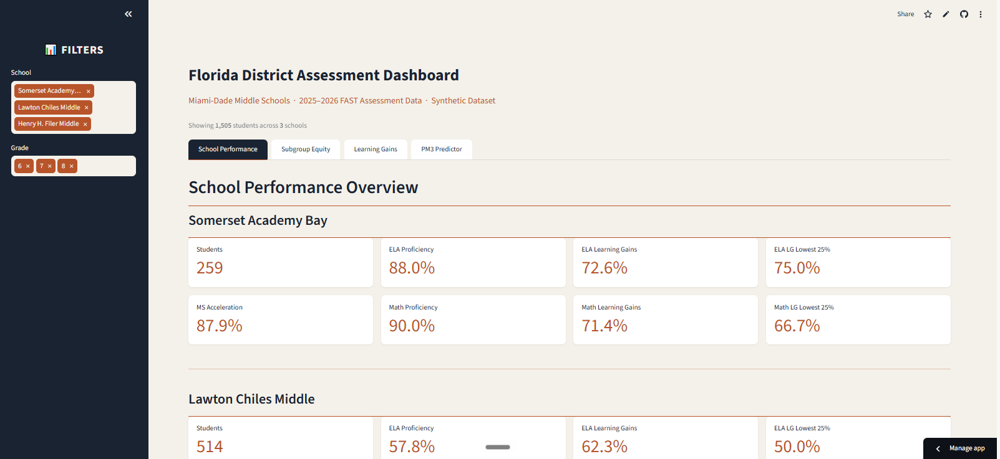

# Florida District Assessment Dashboard

I built this dashboard to show how I work with K-12 assessment data. It pulls from Florida's FAST assessment framework and covers three real Miami-Dade middle schools, looking at their demographics, proficiency rates, learning gains, and where students are falling through the cracks.

**[Live Dashboard](https://florida-district-analytics-c5mojaukanfvquwruyfwau.streamlit.app/)**



---

## What It Does

Four tabs, each answering a different question:

**School Performance.** All seven FLDOE School Grades components per school. ELA and Math proficiency, learning gains, lowest 25%, and middle school acceleration. Side-by-side comparison chart.

**Subgroup Equity.** Breaks everything down by ELL, ESE, and ethnicity. This is where you see the gaps that disappear in school-wide averages.

**Learning Gains & Growth.** PM1 to PM3 score trajectories, who met their learning gains target, who didn't, and by how much they missed.

**PM3 Predictor & Bubble Students.** Projects PM3 scores based on PM1-to-PM2 growth, flags students within striking distance of proficiency, and shows what happens to school-wide rates if you move them across the cut.

---

## Why It Matters

The calculations aren't generic. They follow FLDOE's actual rules:

- Math Achievement excludes Algebra 1 EOC students. Math Learning Gains includes them. Getting that wrong changes the numbers.
- Learning gains use Pts4LG (points for learning gains) based on sub-level cuts, and Algebra 1 uses different logic than regular math.
- Lowest 25% is based on prior-year percentile, not current scores.
- Ethnicity breakdowns only show groups with 5+ students to avoid misleading small-sample rates.

---

## The Data

The dataset is synthetic, but it's built from real information. I used district-released school grades and score breakdowns by section to calibrate the numbers, then researched each school's actual demographics through NCES 2024-25 data so the synthetic students reflect the real population. All scale scores, achievement levels, and learning gains follow the state's actual rules by grade level. The proficiency cuts, sub-level boundaries, and Pts4LG targets are pulled from FLDOE's published tables, not made up.

This dashboard focuses on **Math, ELA, and Accelerated Math** only. Middle school students also take Science (8th graders not in Biology), Civics (7th grade only), and some take Biology EOC or Geometry EOC. I scoped this to the core subjects that drive most of the School Grades calculation. For MS Acceleration, FLDOE includes Biology EOC, Algebra 1 EOC, and Geometry EOC, but this dataset only covers Algebra 1 EOC.

Miami-Dade has over 470 schools. I picked three middle schools with different performance levels (A, B, and C) and different demographic profiles to show how the same metrics look across varying contexts. 1,505 students total:

| School | LOC | Students | Notes |
|--------|-----|----------|-------|
| Somerset Academy Bay | 6128 | 259 | 94% Hispanic, 15% ELL, charter, A school |
| Lawton Chiles Middle | 6161 | 514 | 82% Hispanic, 15% Black, 30% ELL, B school |
| Henry H. Filer Middle | 6171 | 732 | 98% Hispanic, 40% ELL, C school |

---

## Run It

```bash
git clone https://github.com/YOUR-USERNAME/florida-district-analytics.git
cd florida-district-analytics
python -m venv venv
venv\Scripts\activate        # Windows
# source venv/bin/activate   # Mac/Linux
pip install -r requirements.txt
streamlit run app.py
```

Built with Python, Streamlit, Pandas, and Plotly.

---

Built by Karla Lopez.
